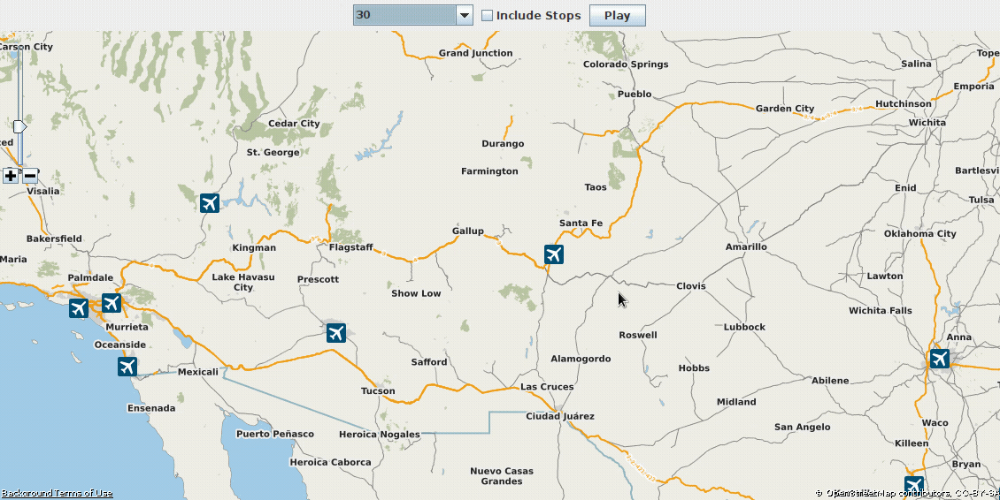

# Exam 3: One Direction - One Way or Another
In Exam 3, you will be extending Project 5's map GUI for the triplog dataset which we have been working with over the course of the semester.

## Required New Functionality
First, replace the raccoon head leading the path, with the given `arrow.png` which looks like this:

Then, modify your (or the supplied Project 5 solution) code to make the arrow rotate according to the direction of travel between every two consecutive coordinates in the trip. 

To calculate the angle between two GPS coordinates, you need to first calculate the difference between the longitude and latitude values of the two points. You can use the following formula to calculate the angle:

$angle = arctan((y2 - y1) / (x2 - x1))$

Where $x1$ and $y1$ are the longitude and latitude values of the first point, and $x2$ and $y2$ are the longitude and latitude values of the second point. The arctan function returns the angle in radians, so you may need to convert it to degrees. Then rotate the arrow by that many degrees. Repeat the process for every consecutive coordinates in `triplog.csv`, keeping in sync with the path animation.

Here is how the animation should look like:

## Grading

Submit (commit and push) your exam before the due date/time. **No late submissions allowed.**
